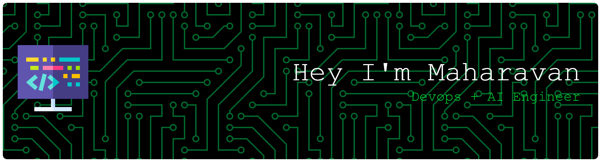

  
   
  
  

  <h1>
    Hey there!  I'm Maharavan
  </h1>
  <h3>
    🚀 DevOps Engineer & AI Engineer | Full-Stack & Cloud Enthusiast 🚀
  </h3>

  I’m a DevOps Engineer at Robert Bosch with 3+ years of experience in <strong>infrastructure automation, CI/CD pipelines, and cloud-native solutions</strong>. I thrive at the intersection of <strong>Cloud, AI, and Full-Stack development</strong>, delivering <strong>intelligent, scalable, and efficient systems</strong>.

  

---

## 🛠️ Tech Stack

**DevOps & Cloud:**  
      

**Backend & Scripting:**  
  

**Web & App Development:**  
  

**AI & LLM Integration:**  
  

---

## 📊 GitHub Stats

  
  

---

## ✨ Connect with Me

    
